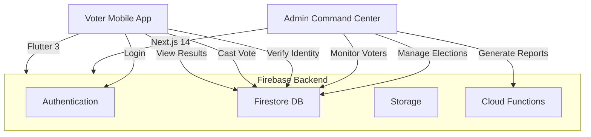

# Sovereign Voting System

A secure, enterprise-grade digital voting platform built with Next.js, Firebase, and Flutter. This system replaces traditional paper ballots with cryptographic identity verification and real-time election monitoring.

## 🏗️ Architecture



## 🛠️ Technology Stack

### Backend & Infrastructure
- **Firebase**: Authentication, Firestore Database, Cloud Storage
- **Firebase Admin SDK**: Server-side management and verification
- **Node.js 20**: Backend logic
- **Next.js 14**: Admin web interface

### Frontend (Mobile)
- **Flutter 3**: Cross-platform mobile application
- **Provider**: State management
- **Google Fonts**: Professional typography
- **Material Icons**: Rich UI

## 🚀 Getting Started

### Prerequisites
- Node.js (20.x recommended)
- Flutter SDK
- Firebase CLI
- Java (for Android development)
- **ADB Tools** (For wireless debugging)

### Installation

1.  **Clone the repository**
    ```bash
    git clone <repository-url>
    cd VotingSystem
    ```

2.  **Backend Setup**
    ```bash
    cd admin_v2
    npm install
    ```

3.  **Configure Firebase**
    - Ensure `firebase.json` points to your project
    - Create a `.env.local` file with your Firebase credentials.

4.  **Frontend Setup**
    ```bash
    cd ../frontend_mobile
    flutter pub get
    ```

---

## 💻 Available Commands

### Admin Web (Next.js)

| Command | Explanation |
| :--- | :--- |
| `npm run dev` | **Development Mode**: Starts the local server at `http://localhost:3000`. Changes in code are reflected instantly (Hot Reload). |
| `npm run build` | **Production Build**: Compiles and optimizes the application for deployment. This creates a `.next` folder with minimized assets. |
| `npm start` | **Production Run**: Starts the server using the compiled build. This is faster and more stable than dev mode. |

### Mobile App (Flutter)

| Command | Explanation |
| :--- | :--- |
| `flutter run` | **Debug Run**: Compiles the app and installs it on your connected device/emulator. Supports "Hot Reload" (press `r`). |
| `flutter build apk` | **Release Build**: Generates a standalone `.apk` file located in `build/app/outputs/flutter-apk/`. This is the file you share with users. |
| `flutter pub get` | **Dependency Sync**: Downloads all libraries and packages listed in `pubspec.yaml`. |

---

## 🏗️ Step-by-Step Run Guide

If you are setting up the project for the first time, follow these steps in order:

### 1. Running the Admin Dashboard (Web)
1.  **Navigate to directory**: `cd admin_v2`
2.  **Install Dependencies**: Run `npm install` (Wait for it to finish).
3.  **Launch App**: Run `npm run dev`.
4.  **Access**: Open [http://localhost:3000](http://localhost:3000) in your browser.

### 2. Running the Mobile Application (Flutter)
1.  **Navigate to directory**: `cd frontend_mobile`
2.  **Install Dependencies**: Run `flutter pub get`.
3.  **Check Device**: Run `flutter devices` to ensure your phone/emulator is detected.
4.  **Launch App**: Run `flutter run`.

### 3. Generating the App for Users (APK)
1.  **Navigate to directory**: `cd frontend_mobile`
2.  **Build**: Run `flutter build apk --release`.
3.  **Locate File**: Your APK will be at `build/app/outputs/flutter-apk/app-release.apk`.

---

## 📱 Running Mobile App Without USB (Wireless Debugging)

To run the Flutter app on your physical phone without being tethered by a USB cable, follow these steps:

### 1. Initial Setup (One-time via USB)
1.  Connect your phone to your PC via USB cable.
2.  Ensure **USB Debugging** is enabled in your phone's Developer Options.
3.  Open your terminal and run:
    ```bash
    adb tcpip 5555
    ```
    *Note: If `adb` is not recognized, use the full path to your platform-tools folder (e.g., `C:\Users\Name\AppData\Local\Android\Sdk\platform-tools\adb.exe`).*

### 2. Connect Wirelessly
1.  Disconnect the USB cable.
2.  Find your phone's **IP Address**:
    - Go to **Settings** > **About Phone** > **Status** (or Network) > **IP Address**.
    - It usually looks like `192.168.1.XX`.
3.  In your PC terminal, run:
    ```bash
    adb connect <YOUR_PHONE_IP>:5555
    ```
4.  Verify connection:
    ```bash
    adb devices
    ```
    You should see your device IP listed as "device".

### 3. Run the App
Now you can simply run:
```bash
cd frontend_mobile
flutter run
```

---

## 📖 Full Application Overview

### 1. Admin Dashboard (`admin_v2`)
The brain of the system. Administrators can:
- **Monitor Voter Registry**: View, search, and filter the master list of official voters.
- **Live Election Tracking**: Real-time charts showing vote counts as they happen.
- **Candidate Management**: Add or remove candidates and their respective party symbols.
- **Security Audit**: View logs of administrative actions to ensure transparency.

### 2. Voter Mobile App (`frontend_mobile`)
The interface for the citizens. The workflow is:
- **Authentication**: Voters log in using their unique EPIC (Voter ID).
- **Identity Verification**: The system checks the EPIC against the master database and verifies the user's Date of Birth and Phone Number.
- **PIN Setup**: Users set a 4-digit secure PIN for their session.
- **Secure Voting**: Voters select a candidate. Before submission, they must enter their PIN to authorize the cryptographic vote casting.
- **Confirmation**: A success screen is shown, and the voter's status is updated to "Voted" in real-time across the system.

### 3. Backend Strategy
## 🖥️ Screen Mirroring (Scrcpy)

To see and control your mobile screen on your laptop while debugging, I recommend using **Scrcpy**. It has already been installed on your system.

### How to use:
1.  **Open a new terminal** (to recognize the `scrcpy` command).
2.  Ensure your phone is connected (via USB or Wireless ADB).
3.  Run the command:
    ```bash
    scrcpy
    ```
4.  **Advanced Options**:
    - **Record Screen**: `scrcpy --record=file.mp4`
    - **No Audio**: `scrcpy --no-audio`
    - **Limit Resolution**: `scrcpy -m 1024` (Faster performance over Wi-Fi)

> [!TIP]
> If the `scrcpy` command is not recognized yet, restart your terminal or use the full path: 
> `C:\Users\TAMILSELVAN RAMAN\AppData\Local\Microsoft\WinGet\Packages\Genymobile.scrcpy_Microsoft.Winget.Source_8wekyb3d8bbwe\scrcpy-win64-v3.3.4\scrcpy.exe`
